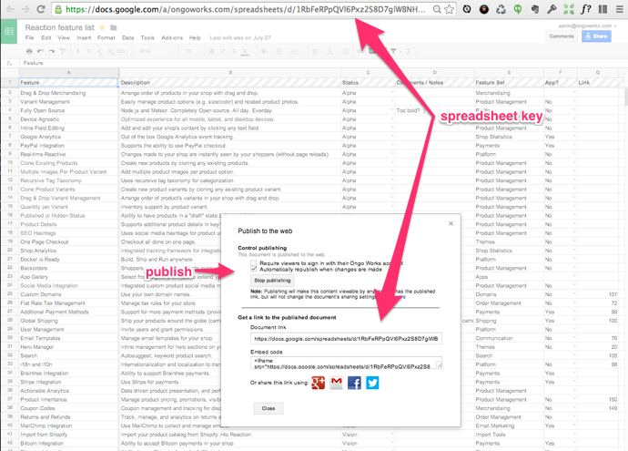

# Using Google Spreadsheets as a CMS for Meteor

Have you ever seen this workflow?

Someone shares a spreadsheet with a team, and several people add their contributions to it.  The spreadsheet becomes the place that it's easy to manage, but eventually that data is meant to be used to manage data elsewhere, and later somebody inputs, copies, or imports the spreadsheet to some other format for presentation on the web. 

At several of the e-commerce companies where I've worked, using a spreadsheet was just part of the typical workflow. For example, buyers would maintain a list of vendors, and products in a spreadsheet. Often this was because they didn't have all the data yet to make the products available - somebody had to decide the best marketing description, a manager needed to make sure the profit margins were correct for pricing,etc. After all that internal process was completed, we'd import that product spreadsheet into our e-commerce software's database when we'd want to make the product available online. In a couple extreme cases, we actually would send the spreadsheet off to a offshore firm who specializes in manual data entry into platforms like Magento. After the data was inputed into the shop, we'd have to recheck it once more for accuracy before publishing! Phew!

At [Ongo Works](http://ongo.works) we maintain a Google Docs Spreadsheet that is a list of features and related information like "status" and "Github Issue" for the [Reaction Commerce](http://reactioncommerce.com/) project. I started looking for a simple CMS for our project features list for [Reaction Commerce](http://reactioncommerce.com/vision), when I thought -  why not just use the spreadsheet itself as our CMS for our site?  Turns out with [Meteor](http://meteor.com) and the [Google Spreadsheet API](https://developers.google.com/google-apps/spreadsheets/?csw=1) this is pretty simple to do.

Here's how I did it:

First you need to publish your spreadsheet, and get the "spreadsheet key".  In your spreadsheet goto `File -> Publish to Web`, start publishing and grab the spreadsheet key from the spreadsheet url.

You can preview the json output of your spreadsheet after publishing with:

`https://spreadsheets.google.com/feeds/list/<spreadsheet key>/od6/public/values?alt=json`

I fetched this with `Meteor.http.get` and created a template helper, and looped through the results to format into an object that my template uses.

*client/view.html*

	Template.view.helpers
	  spreadsheetData: () ->
	    # fetches from a google docs spreadhsheet, with "Feature, Description, Status" cells
	    Meteor.http.get "https://spreadsheets.google.com/feeds/list/<spreadsheet key>/od6/public/values?alt=json",  (error,result) ->
	  	
	  	# loop and do some formatting
	  	items = [];
	    for item,index in result.data.feed.entry
	      items[index].status = item.gsx$status.$t.toLowercase()
	   ...
	   return items

In this case each cell value is accessed with `item.gsx$<column header>.$t`

This works pretty well, but there's usually a second or so delay before the result are rendered. To take care of this, I decided to fetch with a server side method `Meteor.call('spreadsheet/fetch',"<spreadsheet key>")` and insert the results into a collection `GASpreadsheet` and publish this to the client. 

Now, instead of calling the directly using `Meteor.http.get` in the client view, you can do:

	 # fetches from a google docs spreadsheet, with cell data
	 Meteor.call "spreadsheet/fetch","<spreadsheet key>"
	
	 spreadsheetData = GASpreadsheet.findOne({spreadsheet:'<spreadsheet name or index>'})
	 
	 #loop and do some formatting
	 if  spreadsheetData
	   for index,row of spreadsheetData.cells
	     if ( row[1] ) then feature = row[1].value

This will first render the collection (cached copy), but will also update with the latest from the spreadsheet whenever a user views this page.

I've created a package that you can use at [ongoworks/meteor-google-spreadsheet](https://github.com/ongoworks/meteor-google-spreadsheets)

In this package, the spreadsheet is fetched using the NPM package [node-google-spreadsheets](https://github.com/samcday/node-google-spreadsheets), wrapped, and inserted into the collection `GASpreadsheet`.

I'm going to continue to add functionality to the package, two way syncing, editing the spreadsheet data in Meteor,etc as time permits.

So, now I have a CMS with team administration and revision control. I could easily add a field "visible", and filter the results by properties before displaying in the template view.  

Easy and fun. Hope you enjoy it.

